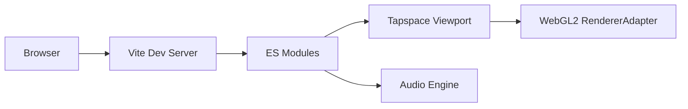

# Relative Music Theory (RMT) App

A revolutionary approach to musical notation and composition based on rational number relationships.

## Overview

The Relative Music Theory (RMT) App is a proof-of-concept for representing and manipulating musical notes and structures via exact ratios, not fixed ET12 steps. This branch modernizes the codebase to native ES modules and introduces a WebGL2 renderer that provides a high‑performance overlay synchronized with the existing Tapspace scene.

What changed in this branch:
- Migrated to ES modules throughout the app, built and served via [vite.config.js](vite.config.js)
- Added a WebGL2 overlay renderer for notes, playhead, measure bars/triangles, octave guides, and selection/hover rings: [RendererAdapter](src/renderer/webgl2/renderer-adapter.js:14)
- Kept Tapspace interactions; the WebGL2 layer mirrors and enhances visuals while exposing CPU picking APIs for future integration

## Demo

Try the RMT Compose demo: https://rmt-compose-poc.vercel.app/

## Features

- Ratio-first music model
  - Represent notes as mathematical relationships (rational numbers)
  - Work with perfect intervals and ratios beyond 12-TET
- Visual composition workspace
  - Infinite, zoomable canvas via Tapspace
  - ES module entry point: [src/main.js](src/main.js)
- New WebGL2 overlay renderer (Phase 1)
  - High‑performance drawing of note bodies with rounded borders, selection and hover rings
  - Crisp, scale-stable fraction labels with a glyph cache/atlas and an interior mask
  - Measure indicators:
    - Dashed vertical measure bars and solid start/end bars
    - Bottom-edge measure triangles with labels
  - Octave guides:
    - Horizontal dotted lines with labels (BaseNote, +k, −k)
  - Playhead line with pixel-snapped rendering
  - CPU picking helpers for notes, measure triangles, and BaseNote circle
  - Core adapter and lifecycle:
    - Class: [RendererAdapter](src/renderer/webgl2/renderer-adapter.js:14)
    - View basis sync: [RendererAdapter.updateViewportBasis()](src/renderer/webgl2/renderer-adapter.js:343)
    - Scene sync: [RendererAdapter.sync()](src/renderer/webgl2/renderer-adapter.js:377)
    - Playhead: [RendererAdapter.setPlayhead()](src/renderer/webgl2/renderer-adapter.js:731)

## Technology

- WebGL2 overlay renderer: [src/renderer/webgl2/renderer-adapter.js](src/renderer/webgl2/renderer-adapter.js)
- Tapspace.js for infinite 2D workspace
- Fraction.js for exact ratio math
- Vite for development and build: [vite.config.js](vite.config.js)
- ES modules throughout the app (see [package.json](package.json))

## Quick Start

Requirements:
- Node.js 18+ (ESM + Vite 7)
- A modern browser with WebGL2 enabled

Install and run:
- npm install
- npm run dev
- Open the local URL printed by Vite (defaults to http://localhost:3000)

Build:
- npm run build
- npm run preview

## Browser Support and Fallbacks

- WebGL2 is required for the overlay renderer. If WebGL2 is unavailable, the app still loads, but overlay visuals are disabled (the adapter safely does not initialize).
- Tapspace-based DOM rendering remains functional; interactions are preserved.

## Developer Notes

- Entry points and modules
  - App entry: [src/main.js](src/main.js)
  - WebGL2 workspace integration: [src/renderer/webgl2/workspace.js](src/renderer/webgl2/workspace.js)
  - Camera basis publisher: [src/renderer/webgl2/camera-controller.js](src/renderer/webgl2/camera-controller.js)
  - WebGL2 adapter: [src/renderer/webgl2/renderer-adapter.js](src/renderer/webgl2/renderer-adapter.js)
- Glyph atlas toggle for text rendering
  - Enable/disable via URL: ?atlas=1 or ?atlas=0
  - Or localStorage key: rmt:atlas with value 1 or 0
- Public data and assets
  - Modules and presets: [public/modules](public/modules)
  - Instruments and samples: [public/instruments](public/instruments)

## Current Status

This is still a proof-of-concept. The WebGL2 layer is integrated as a synchronized overlay. Interactions remain driven by the existing Tapspace DOM and logic, while the overlay provides performance and fidelity improvements and exposes CPU picking utilities for future integration.

## Architecture

Key files:
- App entry: [src/main.js](src/main.js)
- Renderer adapter: [src/renderer/webgl2/renderer-adapter.js](src/renderer/webgl2/renderer-adapter.js)
- Workspace integration: [src/renderer/webgl2/workspace.js](src/renderer/webgl2/workspace.js)
- Camera basis publishing: [src/renderer/webgl2/camera-controller.js](src/renderer/webgl2/camera-controller.js)

## Changelog

- Refactor to ES modules and Vite-based dev/build
- Add WebGL2 overlay renderer with:
  - Rounded note bodies with selection/hover rings
  - Fraction labels with glyph cache/atlas and interior mask
  - Playhead and measure visualization (dashed bars, solid start/end bars, triangles with labels)
  - Octave guides with dotted lines and labels
  - CPU picking utilities for notes, measure triangles, and BaseNote circle
- Performance improvements via instancing and screen-space paths
- Developer toggles for glyph atlas

## Learn More

For background on the theory: https://cybercyril.com

## License

Relative Music Theory Personal Non‑Commercial License (RMT‑PNC) v1.0

- Personal, non‑commercial use only
- Private modifications allowed (no distribution or hosting)
- No redistribution of the app or its assets
- Outputs (music, audio, video, MIDI, scores) may be shared non‑commercially only
- Public sharing requires attribution: “Made with Relative Music Theory (RMT) – https://cybercyril.com/”

See full terms in [LICENSE.md](LICENSE.md). For commercial licensing, email cyril.monkewitz@gmail.com