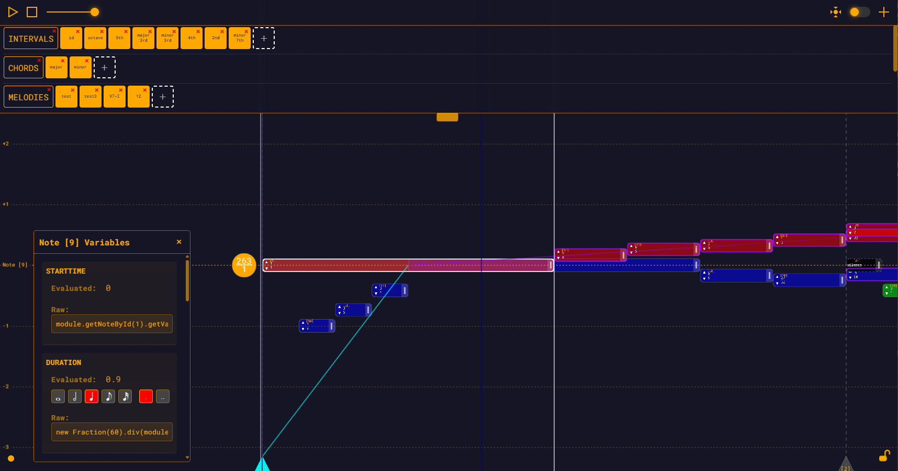

# Relative Music Theory (RMT) App

A production-ready, GL-only composition tool built around rational number relationships (ratios) instead of fixed 12-TET steps.

## Live Demo

- Try it in your browser: https://www.rmt.world/
- Screenshot:



## Overview

The app represents and manipulates musical structures as exact ratios and durations, with support for equal temperament systems (12-TET, 19-TET, 31-TET, Bohlen-Pierce). A WebGL2 interactive Workspace handles all rendering and interactions with a high-performance instanced pipeline. The legacy DOM rendering layer has been removed; the Workspace and its camera are the sole sources of truth for visualization and picking.

## Architecture

The app uses a **binary bytecode compilation system** for expression evaluation:

- **Expressions**: All note parameters (frequency, duration, startTime, tempo, etc.) are compiled from text to compact binary bytecode at load time
- **Evaluation**: A stack-based VM evaluates bytecode with Fraction pooling to minimize garbage collection during interactive operations
- **Dependency Tracking**: An inverted index provides O(1) lookup for forward and inverse dependencies, enabling smart drag previews (only notes whose position actually depends on the dragged note are moved)
- **WASM Optimization**: Optional Rust/WASM core for computationally intensive evaluation operations

## Features

- Ratio-first music model
  - Notes express frequency, duration, and start time as exact expressions (compiled to bytecode backed by Fraction.js)
  - Dependency-aware evaluation with O(1) lookup and caching
  - Property-specific dependency tracking (startTime vs duration)

- Multi-TET system support
  - Built-in support for 12-TET, 19-TET, 31-TET, and Bohlen-Pierce (13-BP) tuning systems
  - Notes using TET frequencies display **≈** prefix to indicate irrational/approximated values
  - Create custom TET modules using power expressions

- Interactive WebGL2 Workspace
  - Pan/zoom camera with affine world-screen basis
  - Selection, move, resize
  - Measure editing (drag triangles), dashed/solid measure bars
  - Snapping to sixteenth notes
  - Dependency-aware previews during drag/resize
  - Crisp fraction labels and instanced rounded rectangles
  - Octave guides and BaseNote indicator
  - GPU/CPU picking for notes, measures, and BaseNote

- Playback and audio
  - Web Audio-based engine, with shared nodes and graceful pause/stop
  - Playhead tracking (optional), pixel-snapped playhead line
  - Volume control

- Productivity
  - Undo/Redo history
  - Load module from file (Main menu > Load Module)
  - Drag a module from the Module Bar onto the workspace
  - Export current module to file
  - Scale controls (X/Y) for time/frequency density; camera tracking integration

## Requirements

- Node.js 18+
- A modern browser with WebGL2 enabled
- (Optional) Rust toolchain for WASM builds

## Quick Start

Install and run the dev server:

```bash
npm ci
npm run dev
```

Open the URL printed by Vite (typically http://localhost:3000).

Build and preview a production bundle:

```bash
npm run build
npm run preview
```

### WASM Build (Optional)

To build the Rust/WASM core for enhanced performance:

```bash
npm run build:wasm
```

## Controls and Workflow

- Transport
  - Play/Pause button at the top-left
  - Stop button next to Play/Pause
  - Volume slider
- View and tracking
  - Reset View button centers the Workspace on BaseNote (disabled when tracking is on)
  - Tracking toggle keeps the playhead centered during playback
  - Scale controls (bottom-left dot): adjust horizontal (time) and vertical (frequency) density
- Editing
  - Click to select a note or measure
  - Drag note body to move; drag the right tab to resize
  - Click +/- octave regions to transpose by octaves
  - Drag measure triangles at the bottom to adjust measure positions; dependent notes preview live
- Import/Export
  - Load Module from file via the main menu; Save Module to export the current module; Reset to the default module from the same menu
  - Drag a module from the Module Bar onto the workspace to load it
- Keyboard
  - Undo: Ctrl/Cmd+Z
  - Redo: Ctrl/Cmd+Y

## Module Bar

- Browse example modules by category (Intervals, Chords, Melodies, Custom)
- Load a module by dragging it from the Module Bar onto the workspace
- Load a module from file via the main menu (Main menu > Load Module)

### Create your own Module Bar items

1) Add your module JSON to a category folder, for example: [public/modules/custom](public/modules/custom)
2) Update that category's index to reference your file and label:
   - Edit [public/modules/custom/index.json](public/modules/custom/index.json)
   - Add an entry for your file (e.g., "my module.json") with the display label you want
3) Save and refresh the app (or restart the dev server). Your module will appear under the Custom category

Notes:
- The default module lives at [public/modules/defaultModule.json](public/modules/defaultModule.json)
- Other built-in categories follow the same pattern with their own index.json files

## Equal Temperament Systems

While RMT is built around exact ratios, it also supports equal temperament tuning systems for exploring microtonal and alternative scales.

### Included TET Modules
Load these from the Module Bar under Melodies:
- **TET-12** - Standard 12-tone equal temperament (semitones)
- **TET-19** - 19 equal divisions of the octave
- **TET-31** - 31 equal divisions of the octave (high-resolution)
- **BP-13** - Bohlen-Pierce scale (13 equal divisions of 3:1 instead of 2:1)

### Understanding the ≈ Symbol
Notes with equal temperament frequencies display an **≈** prefix before their frequency fraction. This indicates that the displayed value is an approximation of an irrational number (like 2^(1/12)).

### Creating Custom TET Modules
To create notes in a TET system, use power expressions for frequency:

| System | Frequency Step Expression |
|--------|---------------------------|
| 12-TET | `new Fraction(2).pow(new Fraction(1, 12))` |
| 19-TET | `new Fraction(2).pow(new Fraction(1, 19))` |
| 31-TET | `new Fraction(2).pow(new Fraction(1, 31))` |
| BP-13  | `new Fraction(3).pow(new Fraction(1, 13))` |

Chain the step to move up the scale:
```json
"frequency": "previousNote.getVariable('frequency').mul(new Fraction(2).pow(new Fraction(1, 12)))"
```

## File Structure

### Core Expression System
- src/binary-note.js - Binary expression format and bytecode classes
- src/binary-evaluator.js - Stack-based bytecode interpreter with Fraction pooling
- src/dependency-graph.js - O(1) dependency tracking with inverted index
- src/expression-compiler.js - Text-to-bytecode compiler and decompiler
- src/module-serializer.js - JSON import/export for binary modules

### Application
- src/main.js - ES module entry point
- src/player.js - Orchestrates Workspace, audio, history, UI wiring
- src/module.js - Module data model with binary evaluation
- src/note.js - Note model with binary expressions

### Rendering & Audio
- src/renderer/webgl2/workspace.js - Interactive Workspace (camera, picking, interactions)
- src/renderer/webgl2/renderer.js - WebGL2 programs, instancing, text, overlays, picking
- src/renderer/webgl2/camera-controller.js - Camera and world-screen basis publication
- src/player/audio-engine.js - Audio graph and playback controls

### WASM Core (Optional)
- rust/ - Rust implementation for high-performance evaluation
- src/wasm/ - JavaScript adapters for WASM integration

### Assets
- public/modules - Bundled example modules and presets
  - melodies/ - Includes TET examples (TET-12, TET-19, TET-31, BP-13)

## Browser Support and Fallbacks

- WebGL2 is required. If WebGL2 cannot be created, the Workspace will not initialize.

## Learn More

- Article and theory background: https://cybercyril.com

## License

Relative Music Theory Personal Non-Commercial License (RMT-PNC) v1.0

- Personal, non-commercial use only
- Private modifications allowed (no distribution or hosting)
- No redistribution of the app or its assets
- Outputs (music, audio, video, MIDI, scores) may be shared non-commercially only
- Public sharing requires attribution: "Made with Relative Music Theory (RMT) - https://cybercyril.com/"

See full terms in LICENSE.md. For commercial licensing, email cyril.monkewitz@gmail.com
