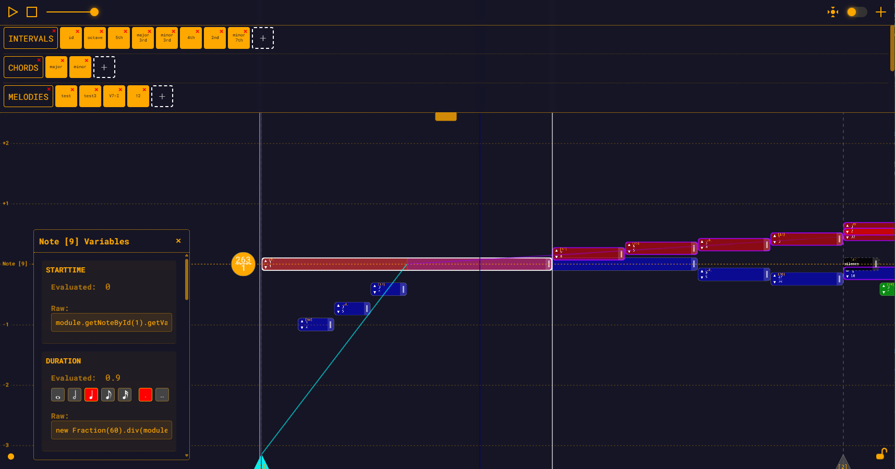

# Relative Music Theory (RMT) App

A GL-only composition tool built around rational number relationships (ratios) instead of fixed 12-TET steps.

## Live Demo

- Try it in your browser: https://www.rmt.world/
- **Full documentation**: https://docs.rmt.world/ — guides, tutorials, reference
- **Contributing / continuing development?** Start with the [developer docs](https://docs.rmt.world/developer/) — architecture, core systems, performance, and contributing guides.
- Screenshot:



## Overview

The app represents and manipulates musical structures as exact ratios and durations. Every note property — frequency, duration, start time, tempo — is an *expression* referencing the base note or another note, so a composition is a dependency graph, not a list of absolute values. Move one note and everything anchored to it follows. Equal-temperament systems (12-TET, 19-TET, 31-TET, Bohlen-Pierce) are expressible in the same language via power expressions.

A WebGL2 workspace handles all rendering and interaction with an instanced pipeline. There is no DOM per note.

### Expression DSL

Note properties are defined using a concise **Domain-Specific Language (DSL)** that compiles to binary bytecode:

```
base.f * (3/2)           # Perfect fifth above the base note
[1].t + [1].d            # Start when note 1 ends
beat(base) * 2           # Two beats long
2^(7/12)                 # 12-TET perfect fifth interval
```

The DSL replaces the verbose legacy JavaScript syntax. Both formats compile to the same bytecode and are auto-detected per expression; all shipped modules are DSL. See [DSL Expression Syntax](#dsl-expression-syntax) below.

## Architecture

- **DSL compiler** — expressions are lexed, parsed, validated, and compiled to compact binary bytecode. Legacy method-chain syntax (`.mul()/.pow()/...`) is auto-detected and still supported.
- **Evaluation** — a stack-based VM walks the bytecode with `fraction.js` (BigInt-backed) for exact rational arithmetic at any magnitude and depth, backed by a Fraction pool to keep allocation off the drag path. Powers that resolve to an irrational value flag the note as *corrupted* (shown as `≈` in the note widget and cross-hatched on the canvas).
- **Dependency tracking** — an inverted index gives O(1) forward and inverse lookup, split per property (startTime / duration / frequency). Drag previews move only the notes whose position actually depends on the note under the cursor.
- **Incremental re-evaluation** — a Kahn topological sort over the dirty set only, not the whole module.
- **Rendering** — every visual class (note bodies, rings, measure bars, dependency lines, glyphs) is one instanced draw call. Per-note overlay work is culled to the viewport, and the renderer redraws only when something changed: an idle canvas issues **zero draw calls**.
- **No `eval`, no `new Function`** anywhere. Expressions only ever become bytecode.

### Performance

Measured with the in-repo Playwright harness (headless Chromium, 1600x900, GPU-backed):

| Notes | Idle | Pan | Full redraw | `renderer.sync()` (per edit) |
|---|---|---|---|---|
| 5,000 | 60 fps, 0/100 frames redrawn | 60 fps | 0.77 ms | 2.0 ms |
| 20,000 | 60 fps, 0/100 frames redrawn | 60 fps | 1.75 ms | 13.1 ms |
| 100,000 | 60 fps, 0/100 frames redrawn | 60 fps | 4.27 ms | 63.3 ms |

Dragging a hub note with 4,999 direct dependents holds p99 **18.0 ms**; the only frame over 33 ms is the drop itself. CPU picking costs 0.31 ms per call at 100k notes. Evaluation (Node, JS evaluator) is **1–3 ms** for a full re-eval at 1,000 notes and sub-millisecond for a typical mid-graph commit.

The 100k figure is about **rendering**, not editing: `sync()` is the remaining bottleneck at that scale, so panning and playing a 100k-note module is smooth but editing one is not interactive. Incremental `sync()` is still on the roadmap.

## Features

- **Ratio-first music model**
  - Notes express frequency, duration, and start time as DSL expressions over other notes (e.g. `base.f * (3/2)`, `[1].t + [1].d`)
  - Exact rational arithmetic; expressions compile to bytecode
  - Property-coloured dependency visualization: orange = frequency, teal = startTime, purple = duration
  - Corrupted (irrational) values are cross-hatched on the canvas and prefixed `≈` in the widget

- **Interactive WebGL2 workspace**
  - Pan / zoom / pinch camera (0.1x – 10x), affine world-screen basis
  - Move, resize, transpose; measure editing via drag triangles; dashed/solid measure bars
  - Dependency-aware live previews during drag and resize
  - Instanced rounded rectangles, glyph-atlas text, crisp fraction labels, octave guides, BaseNote indicator
  - CPU picking with rounded-rect hit testing and stack cycling on overlapping notes

- **Multi-note selection**
  - Marquee: **shift-drag** on desktop, **long-press then drag** on touch
  - Refine with shift-click (desktop) or long-press (touch) on individual notes
  - Group drag in time as one undoable move; relationships inside the selection are preserved byte-for-byte
  - **Delete all** — dependents outside the group are *liberated* (expressions inlined) so they keep their positions
  - **Copy to Modules** — exports the selection as a self-contained module into the library's Custom section, rooted at its earliest note, tree intact

- **Settings panel** (gear in the top bar; floating, draggable, non-modal, live — no OK/Apply)
  - **Appearance** — 4 theme presets (Classic Orange, Slate Cyan, Mono Light, High Contrast), 15 per-token colour pickers, note height / border / corner radius
  - **Arrows** — the ▲/▼ transposition arrows are no longer octave-only: set any ratio in `[1/16, 16]` (quick-pick chips for octave, fifth, fourth, major 3rd, whole tone, syntonic comma), with a live cents readout; arrows can be turned off entirely (glyphs *and* hit zones)
  - **Audio** — master volume, default instrument, reverb, stereo width, limiter
  - **Library** — icon size, show cents
  - **Scale** — X/Y density plus editable slider limits (0.001 – 1000)
  - Persisted to `localStorage` under `rmt:settings:v1`, validated on every write

- **Audio**
  - Persistent Web Audio signal graph: per-instrument buses → reverb send/return → master gain → limiter
  - **Algorithmic reverb** — the impulse response is synthesised in the browser at runtime (no audio assets); room size, decay, damping, pre-delay and wet amount are live (IR re-renders debounced)
  - Optional **pitch panning** (low notes left, high notes right) and a peak limiter
  - 9 instruments: 7 synthesized (`sine-wave`, `square-wave`, `sawtooth-wave`, `triangle-wave`, `organ`, `vibraphone`, `fm-epiano`) and 2 **multisampled** (`piano`, `violin`) cut from the CC0 VSCO-2 Community Edition library. Sample zones are decoded lazily, only for the notes about to play.
  - Instruments inherit down the frequency dependency chain; a note without an explicit instrument takes its ancestor's, falling back to the global default
  - Click-free ADSR, 200 ms pause fade, 20 ms stop de-click
  - **Loop playback** — shift-click or long-press Play. Gapless at the seam: release tails and reverb ring across the loop boundary.

- **Module library** (79 modules in 6 sections — see [Module Library](#module-library))

- **Productivity**
  - Undo/redo (50 entries, 12 MB cap), autosaved composition (`rmt:moduleSnapshot:v1`), autosaved library layout (`ui-state`)
  - Load / save module JSON; reorder module; reset to default
  - Persistent X/Y scale (time and frequency density)
  - Mobile: pointer-events throughout, real viewport measurement (not `100vh`), touch drag, pinch-zoom, coarse-pointer hit targets

## Requirements

- **Node.js 20.19+ or 22.12+** (Vite 7's requirement)
- A modern browser with **WebGL2** — the workspace does not initialize without it
- (Optional) Rust + `wasm-pack`, only if you want to rebuild the WASM artifacts

## Quick Start

```bash
npm ci
npm run dev
```

Vite serves on **http://localhost:3000** and opens a browser.

Build and preview a production bundle:

```bash
npx vite build      # what the Vercel deploy runs
npm run preview
```

> `npm run build` is `npm run wasm:build && vite build` and therefore **requires Rust + `wasm-pack` on PATH**. Contributors without a Rust toolchain should run `npx vite build` directly — the WASM artifacts are committed.

Other scripts:

| Script | What it does |
|---|---|
| `npm test` | Validates all 79 library modules (structure, expressions, self-containedness, finite evaluation, ratio/cents). **Not a unit-test suite** — the repo has no test framework. |
| `npm run gen:intervals` | Regenerates the 46 interval modules and patches `library.json` |
| `npm run perf:gen` / `npm run perf:bench` | Generate stress modules; benchmark evaluation in Node |
| `npm run samples:build` | Rebuilds the piano/violin samples from VSCO-2 CE (needs `ffmpeg` + network) |
| `npm run docs:dev` / `docs:build` / `docs:preview` | The VitePress docs site in `docs/` |
| `npm run wasm:build` / `wasm:sync` | See below |

### WASM (optional, and not currently usable)

A Rust core (`rust/`, crate `rmt-core`) compiles to WebAssembly and implements an alternative evaluator. **It is not active.** Activation is opt-in via `?evaluator=wasm` — without that flag the 384 KB binary is not even fetched (`initWasm()` returns early; headless Node still initializes for benches). Opting in currently **hangs the main thread** on a full re-evaluation cycle — a non-deterministic bug in the Rust `PersistentEvaluator`. Everything you see in the app runs on the JavaScript evaluator, which after the Phase 1/8 work is fast enough on its own (sub-2 ms evaluation at 1000 notes). The WASM path passes in Node; the hang is browser-only.

Do not enable it. The infrastructure is here for when the hang is fixed.

To rebuild the artifacts (they are **committed** to `src/wasm/`, which is what the app and the Vercel deploy actually use):

```bash
npm run wasm:build      # wasm-pack build + sync into src/wasm/
```

If you built the crate by hand, sync with `npm run wasm:sync` and commit the updated `src/wasm/rmt_core*` files.

## Controls and Workflow

- **Transport** (top-left)
  - Play/Pause, Stop, volume slider (0–1, persisted)
  - **Shift-click or long-press Play** to toggle endless loop playback
- **View** (top-right)
  - Reset View centers on the BaseNote (disabled while tracking is on)
  - Playhead tracking keeps the playhead at the horizontal center — this **locks horizontal panning** for as long as it is on
  - **Gear** opens the Settings panel (five tabs). It is the only way in; there is no menu entry.
  - **+** opens the main menu: Undo, Redo, Reorder Module, Save Module, Load Module (from file / reset to default), plus Documentation, Donate, License links
- **Editing**
  - Click to select a note, measure, or the BaseNote; click again on the same spot to cycle through an overlapping stack
  - Drag a note body to move it; drag the right tab to resize
  - Click the ▲/▼ arrows on a note's left edge to transpose by the configured interval (default: an octave)
  - Drag measure triangles at the bottom to move a measure; dependents preview live
  - **Shift-drag** (or long-press-drag on touch) on empty background to marquee-select; **shift-click** (or long-press) a note to toggle it in or out of the group
  - The padlock (bottom-right) freezes all note interaction
- **Scale**
  - The dot at the bottom-left unfolds X (time) and Y (pitch) density sliders. Both are mirrored by Settings → Scale, whose editable limits are the sliders' rails. **Scale now persists across reloads.**
- **Import/Export**
  - Load a module from a file, or drag one from the module library onto a note, a measure bar, or the BaseNote
  - Save Module downloads `module.json` (reindexed on export). Save UI / Load UI export the *library layout*, not a composition.
- **Keyboard** — the only global shortcuts are undo and redo:
  - **Undo: Ctrl/Cmd+Z**
  - **Redo: Ctrl/Cmd+Y or Ctrl/Cmd+Shift+Z**
  - Escape is scoped: it closes the Settings panel, clears the group selection, cancels a confirmation, or closes the library search — but only when focus is already inside that surface. There is no global Escape, no Space-to-play, and no Delete shortcut.

## Module Library

The second bar under the top bar. 79 shipped modules in six sections:

| Section | Count | Contents |
|---|---|---|
| **Intervals** | 46 | 3-limit, 5-limit, 7-limit, higher-limit (11–23) and commas |
| **Chords** | 11 | Major, Minor, Dominant 7th, Harmonic 7th, Minor 7th, Major 7th, Diminished, Augmented, Sus4, Base-3 chord, Base-5 chord |
| **Progressions** | 8 | V7–I, ii–V–I, I–IV–V–I, I–vi–IV–V, plus authentic / plagal / deceptive / half cadences |
| **Melodies** | 7 | Ode to Joy, Twinkle Twinkle, Frère Jacques, Amazing Grace, Greensleeves, Bach Minuet in G, Scarborough Fair |
| **Scale Systems** | 6 | 12-TET, 19-TET, 31-TET, Bohlen–Pierce, Tesla, Mixed-Base |
| **Custom** | 1 | `canon base` — and where your own modules land |

Every module is **relational**. A chord is a root plus ratios *of that root*; a progression chains each root off the previous one, so only the first root ever touches `base`. Drop a module onto a note and the whole structure re-roots onto that note with its tree intact; transpose the first root and the entire progression moves.

- **Drag a module** from the bar onto a note, a measure bar, or the BaseNote to import it. Dropping on empty background or on a silence is rejected.
- **Drop Mode Toggle** (`Drop at: Start | End`) — *Start* anchors imported notes to the target's start time (chords); *End* appends `+ [target].d` so they land after it (sequences/scales). Ignored when dropping on the BaseNote.
- The bar has a **search** magnifier (matches name, ratio, family, cents, tags, file path), its own **Undo/Redo** buttons, collapsible sections, drag-to-reorder, and a resize pull-tab.
- **Save UI / Load UI / Add Category / Reload Defaults** manage the layout, which autosaves to `localStorage` under `ui-state`.

### Adding your own modules

**In the app** — the intended path: select several notes (marquee or shift-click), then hit **Copy to Modules** in the group widget. The selection is exported as a self-contained module and lands in the **Custom** section, rooted at its earliest note, with the dependency tree preserved. It persists across reloads and can be dragged back onto the workspace like any other module. You can also click the dashed **`+`** placeholder at the end of any section to upload a `.json` file.

**In the repo** — the library is driven by a single top-level manifest, [`public/modules/library.json`](public/modules/library.json), shaped `{ "version": 2, "sections": [...] }`:

```jsonc
{
  "version": 2,
  "sections": [
    { "id": "intervals", "label": "Intervals", "items": [
      { "file": "intervals/3-2.json", "name": "Perfect 5th", "ratio": "3/2",
        "cents": 701.955, "family": "3-limit", "tags": ["P5", "perfect", "fifth"] }
    ]}
  ]
}
```

1. Add your module JSON under `public/modules/<section>/`.
2. Add an item to the matching section's `items` array in `library.json`. `file` is required; `name`, `ratio`, `cents`, `family` and `tags` drive the procedurally-drawn tile (family sets the hue; a `n/d` ratio renders as a stacked fraction with a cents caption) and the search index.
3. `npm test` to validate it, then reload. Existing users get the new module without pressing *Reload Defaults* — a stored layout is reconciled against the manifest on every load.

> The per-directory `public/modules/<category>/index.json` files still exist, but they are the **legacy fallback**, used only when `library.json` is missing or not v2 — and that path only knows about four categories. Do not add modules there.

The default composition (what you see on first load) lives at [`public/modules/defaultModule.json`](public/modules/defaultModule.json) and is *not* part of the library.

## DSL Expression Syntax

The DSL is a concise, mathematical notation for defining note relationships. Both DSL and legacy JavaScript syntax are auto-detected; the note widget always *displays* DSL, decompiling the compiled bytecode if the note was authored in legacy form.

### Note References

| Syntax | Description |
|--------|-------------|
| `base.f` | BaseNote frequency |
| `base.t` | BaseNote start time |
| `[1].f` | Note 1 frequency |
| `[5].d` | Note 5 duration |
| `[0].f` | Same as `base.f` — note id 0 *is* the base note |

### Property Shortcuts

| Short | Full Name | Also accepted |
|-------|-----------|---------------|
| `f` | frequency | `freq`, `frequency` |
| `t` | startTime | `s`, `start`, `startTime` |
| `d` | duration | `dur`, `duration` |
| `tempo` | tempo | — |
| `bpm` | beatsPerMeasure | `beatsPerMeasure` |
| `ml` | measureLength | `measureLength` |

`tempo`, `bpm` and `ml` fall back to the base note when the referenced note doesn't define them. `t`, `d` and `f` do not inherit.

### Operators and Literals

```
(3/2)                    # Fraction literal — the parentheses are part of the literal
440                      # Integer
0.5                      # Decimal (rationalized at compile time — prefer fractions for exactness)
base.f * (3/2)           # Multiplication
[1].t + [1].d            # Addition
2^(1/12)                 # Power (right-associative, binds tighter than * and /)
-[1].f                   # Negation
# this is a comment      # '#' to end of line; comments are dropped on save
```

Precedence, loosest to tightest: `+` `-` → `*` `/` → unary `-` → `^` → atoms.

### Built-in Functions

Exactly three. The argument must be a bare note reference (`[N]` or `base`), not an expression.

| Function | Description | Example |
|----------|-------------|---------|
| `beat(note)` | Duration of one beat = `60 / tempo(note)` | `beat(base)` |
| `tempo(note)` | Tempo of that note | `tempo([1])` |
| `measure(note)` | Measure length of that note | `measure(base)` |

`tempo()` and `measure()` are input sugar: they compile to the same bytecode as `.tempo` / `.ml` and are written back as the property form on save. `beat()` is the only helper the decompiler reconstructs.

### Common Patterns

```
# Intervals (frequency relationships)
base.f * (3/2)           # Perfect fifth (just intonation)
base.f * (5/4)           # Major third (just intonation)
base.f * 2^(7/12)        # Perfect fifth (12-TET)

# Timing (sequential notes)
[1].t + [1].d            # Start after note 1 ends
base.t                   # Start with the base note
[1].t + measure([1])     # One measure after note 1

# Duration
beat(base)               # One beat
beat(base) * 2           # Two beats
beat(base) * (1/2)       # An eighth note
beat(base) * base.bpm    # A full measure
```

<details>
<summary>Legacy JavaScript syntax (deprecated)</summary>

The legacy syntax uses method chaining on Fraction objects:

```javascript
// Perfect fifth
module.baseNote.getVariable('frequency').mul(new Fraction(3, 2))

// Note 1 frequency
module.getNoteById(1).getVariable('frequency')

// One beat duration
new Fraction(60).div(module.findTempo(module.baseNote))
```

Legacy syntax is auto-detected and still compiles, but the widget will show it as DSL and re-save it as DSL.
</details>

## Equal Temperament and Scale Systems

RMT is built around exact ratios, but power expressions let it express equal-temperament and other non-just systems in the same language.

### Included scale modules

Load these from the module library under **Scale Systems**:

- **12-TET** — 12 equal divisions of the octave (13 notes: 12 steps + the start)
- **19-TET** — 19 equal divisions of the octave
- **31-TET** — 31 equal divisions of the octave
- **Bohlen–Pierce** — 13 equal divisions of the *tritave* (3:1), not the octave
- **Tesla** — an 81-note base-3 odd-harmonic scale: the odd harmonics 9, 11, 13, … 169 taken over 9. Not an EDO, not octave-repeating; spans ≈4.23 octaves.
- **Mixed-Base** — an experimental scale mixing 2-, 3- and 5-based steps that returns to `base.f`

All six are **chained**: each note's frequency is the *previous* note's frequency times a step, so only note 1 touches `base`. Lift one note and every later note follows.

### Understanding the ≈ symbol

Notes whose frequency involves an irrational power display an **≈** prefix in the note widget and are **cross-hatched** on the canvas — a crosshatch when the note is directly irrational, a single diagonal when it merely depends on one. `4^(1/2)` is *not* corrupted: it resolves to the rational 2.

### Creating custom scale modules

| System | DSL Expression |
|--------|----------------|
| 12-TET | `[prev].f * 2^(1/12)` |
| 19-TET | `[prev].f * 2^(1/19)` |
| 31-TET | `[prev].f * 2^(1/31)` |
| BP-13  | `[prev].f * 3^(1/13)` |

Example — chain notes up the 12-TET scale:
```
[1].f * 2^(1/12)         # Note 2: one semitone above note 1
[2].f * 2^(1/12)         # Note 3: one semitone above note 2
```

## File Structure

### Core expression system
- `src/dsl/` — DSL lexer, parser, compiler, decompiler, and DSL-native simplifier
- `src/binary-note.js` — binary expression format and bytecode opcodes
- `src/binary-evaluator.js` — stack VM with Fraction pooling + incremental (Kahn) evaluator
- `src/dependency-graph.js` — forward/inverse dependency indexes, per property, plus corruption flags
- `src/expression-compiler.js` — DSL/legacy routing, LRU compile cache, legacy compiler + decompiler
- `src/utils/simplify.js` — simplification with a value + corruption-flag equivalence guard

### Application
- `src/main.js` — ES module entry point
- `src/player.js` — orchestrates workspace, audio, history, selection, and all top-bar wiring
- `src/module.js` — module data model, evaluation, save/load, reindex
- `src/note.js` — note model
- `src/store/` — history, app state, event bus consumers
- `src/modals/` — note-variables widget, group widget, evaluate/liberate
- `src/menu/` — module library bar and procedural icon factory
- `src/settings/` — settings schema, store, and panel
- `src/theme/` — theme presets and the theme manager

### Rendering and audio
- `src/renderer/webgl2/renderer.js` — GL programs, instancing, text, overlays, picking
- `src/renderer/webgl2/workspace.js` — interaction state machine (drag, marquee, gestures)
- `src/renderer/webgl2/camera-controller.js` — pan/zoom/pinch and the world-screen basis
- `src/player/audio-engine.js` — streaming scheduler, play/pause/stop/loop
- `src/player/audio-graph.js` — buses, reverb send/return, limiter, master gain
- `src/player/reverb.js` — algorithmic impulse-response generator
- `src/instruments/` — synth + multisample instruments

### WASM core (optional, inert by default)
- `rust/` — the `rmt-core` Rust crate
- `src/wasm/` — committed build artifacts + the evaluator adapter

### Assets and tooling
- `public/modules/library.json` — the v2 library manifest
- `public/modules/` — the 79 shipped modules, plus `defaultModule.json`
- `public/samples/` — the multisampled piano and violin (CC0)
- `scripts/` — module generators, the module validator (`npm test`), the sample builder, and the Playwright perf/visual harnesses

## Browser Support and Fallbacks

- **WebGL2 is required.** If a WebGL2 context cannot be created, the workspace will not initialize.
- WASM support is *not* required — the app runs entirely on the JS evaluator.

## Learn More

- **Documentation**: https://docs.rmt.world/
- Original article: https://cybercyril.com

## License

Released under the [MIT License](LICENSE.md) © 2026 Cyril Monkewitz.

Bundled media assets and dependencies carry their own licenses (fraction.js — MIT;
VSCO-2 Community Edition samples — CC0; Roboto Mono — Apache-2.0). See
[THIRD_PARTY_NOTICES.md](THIRD_PARTY_NOTICES.md) for the full list.
