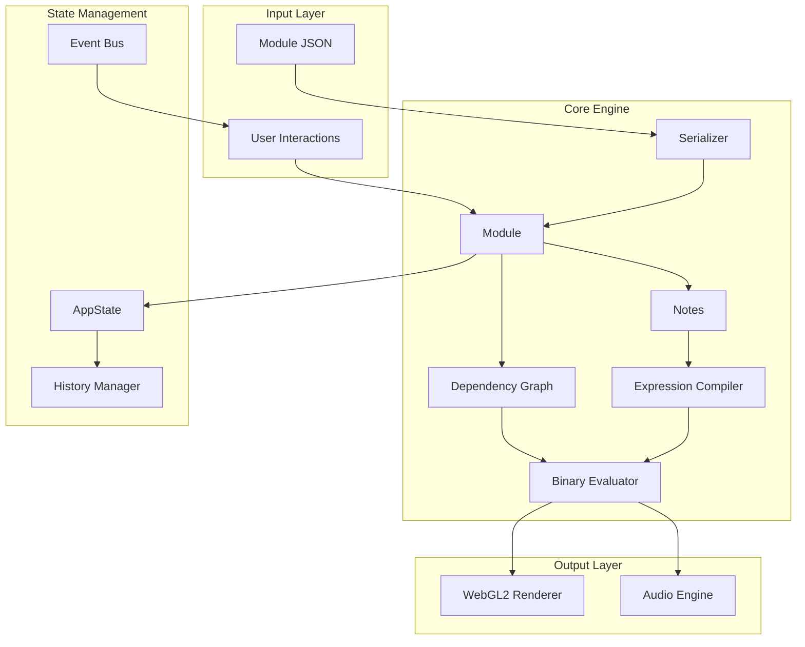

# System Architecture

This page provides a high-level overview of RMT Compose's architecture.

## Design Principles

1. **Expression-Driven**: All note properties are mathematical expressions
2. **Binary Compilation**: Expressions compile to bytecode, not runtime eval
3. **Dependency-Aware**: Smart tracking of note relationships
4. **Performance-First**: WebGL2 rendering, Fraction pooling, optional WASM

## System Diagram



## Layer Responsibilities

### Input Layer

**Module JSON**
- Declarative composition format
- Text expressions (not code)
- Portable and shareable

**User Interactions**
- Workspace events (click, drag, resize)
- Menu actions (save, load, undo)
- Variable widget edits

### Core Engine

**Module** (`src/module.js`)
- Container for notes and baseNote
- Manages evaluation lifecycle
- Handles incremental updates

**Notes** (`src/note.js`)
- Individual musical events
- Binary expressions for each property
- Unique ID for referencing

**Expression Compiler** (`src/expression-compiler.js`)
- Parses text expressions to AST
- Emits binary bytecode
- Handles decompilation for serialization

**Binary Evaluator** (`src/binary-evaluator.js`)
- Stack-based virtual machine
- Evaluates bytecode to values
- Supports Fraction and SymbolicPower

**Dependency Graph** (`src/dependency-graph.js`)
- Tracks note-to-note references
- Inverted index for O(1) lookup
- Property-specific dependency tracking

### Output Layer

**WebGL2 Renderer** (`src/renderer/webgl2/`)
- Instanced rendering for notes
- Camera transformation
- GPU picking for selection

**Audio Engine** (`src/player/audio-engine.js`)
- Web Audio API synthesis
- Streaming scheduler
- Instrument management

### State Management

**AppState** (`src/store/app-state.js`)
- Centralized module reference
- Evaluation cache
- Global state access

**History Manager** (`src/store/history.js`)
- Undo/redo stack
- JSON serialization snapshots
- Debounced capture

**Event Bus** (`src/utils/event-bus.js`)
- Decoupled communication
- Pub/sub pattern
- Cross-module events

## Data Flow

### Load → Display

```
JSON File
    ↓
ModuleSerializer.deserialize()
    ↓
Module (with Notes)
    ↓
ExpressionCompiler.compile() [for each expression]
    ↓
BinaryExpression (bytecode)
    ↓
BinaryEvaluator.evaluate() [for each note]
    ↓
Evaluated Values (startTime, frequency, duration)
    ↓
Renderer.sync() [builds instance buffers]
    ↓
WebGL2 Draw Calls
```

### Edit → Update

```
User Edits Expression
    ↓
Module.updateNote()
    ↓
DependencyGraph.markDirty(noteId)
    ↓
DependencyGraph.getDirtySet() [cascade]
    ↓
IncrementalEvaluator.evaluateDirty()
    ↓
Cache Updated
    ↓
Renderer.sync()
    ↓
History.capture()
```

## Performance Considerations

### Binary Compilation

Expressions compile once at load time:

| Operation | Time |
|-----------|------|
| Parse text expression | ~1ms |
| Emit bytecode | ~0.1ms |
| Evaluate bytecode | ~0.01ms |

This is 100x faster than runtime `eval()`.

### Fraction Pooling

The evaluator maintains a pool of Fraction objects:

```javascript
// Without pooling: allocates new object every time
result = new Fraction(a.n * b.n, a.d * b.d)

// With pooling: reuses existing object
result = pool.alloc(a.n * b.n, a.d * b.d)
```

Reduces GC pressure during high-frequency operations like dragging.

### Inverted Dependency Index

Traditional approach: O(n) scan for dependents
```javascript
// Slow: scan all notes
for (note of notes) {
  if (note.references(targetId)) dependents.push(note)
}
```

RMT approach: O(1) lookup
```javascript
// Fast: direct lookup
dependents = invertedIndex.get(targetId)
```

### Instanced Rendering

Instead of individual draw calls:
```javascript
// Slow: one call per note
for (note of notes) gl.drawArrays(...)
```

Batched instanced rendering:
```javascript
// Fast: one call for all notes
gl.drawArraysInstanced(gl.TRIANGLES, 0, 6, noteCount)
```

## File Organization

```
src/
├── main.js                    # Entry point
├── player.js                  # Main orchestrator (legacy)
├── module.js                  # Module class
├── note.js                    # Note class
├── expression-compiler.js     # Text → bytecode
├── binary-note.js             # Bytecode format
├── binary-evaluator.js        # Stack VM
├── dependency-graph.js        # Dependency tracking
├── module-serializer.js       # JSON import/export
├── renderer/
│   └── webgl2/
│       ├── workspace.js       # Interactive canvas
│       ├── renderer.js        # WebGL2 programs
│       ├── camera-controller.js
│       └── picking.js
├── player/
│   └── audio-engine.js        # Web Audio
├── store/
│   ├── app-state.js           # Global state
│   └── history.js             # Undo/redo
├── utils/
│   └── event-bus.js           # Pub/sub
└── wasm/
    └── evaluator-adapter.js   # WASM bridge
```

## Extension Points

### Adding New Opcodes

1. Define opcode constant in `binary-note.js`
2. Implement in `binary-evaluator.js`
3. Add parser support in `expression-compiler.js`
4. Update decompiler for round-trip

### Adding New Instruments

1. Create instrument definition in `src/instruments/`
2. Register in `audio-engine.js`
3. Add to instrument dropdown in UI

### Adding New Note Properties

1. Add to Note class in `note.js`
2. Update serializer in `module-serializer.js`
3. Add UI controls in variable widget
4. Handle in renderer if visual
