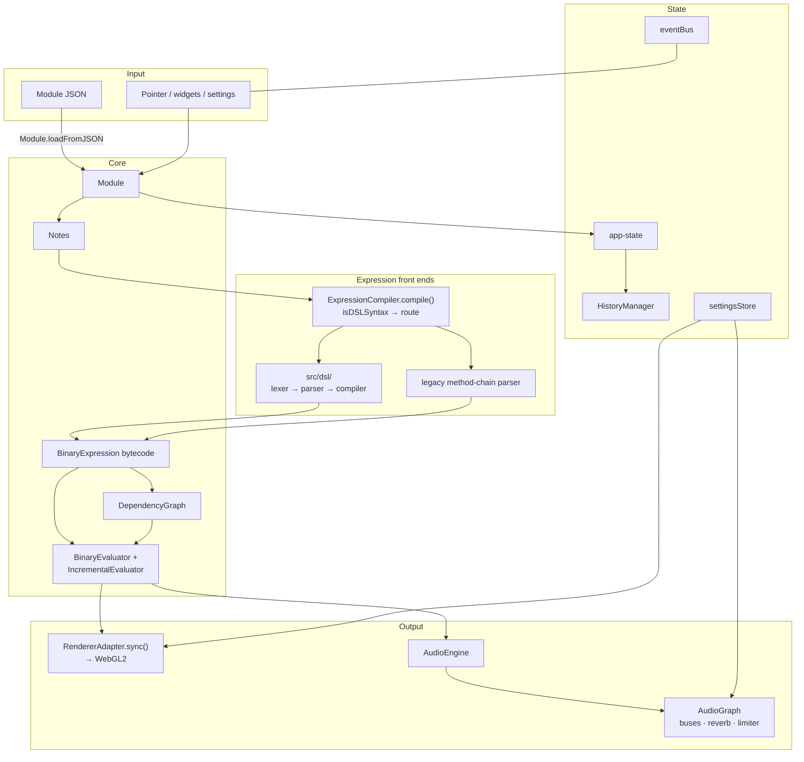

# System Architecture

RMT Compose stores a composition as **relationships, not numbers**. A note's frequency is not
`440`; it is `base.f * (3/2)`. Everything downstream — the dependency graph, the evaluator, the
undo stack, the renderer's hatching — exists to make that idea fast and honest.

## Design principles

1. **Expression-driven.** All six note properties (`startTime`, `duration`, `frequency`, `tempo`,
   `beatsPerMeasure`, `measureLength`) are text expressions. Move a parent and its children follow,
   because they never held a number in the first place.
2. **Compiled, never evaluated.** Expressions compile to a compact bytecode and run on a stack VM.
   Nothing in the app calls `eval()` or `new Function()` — that is a security guarantee, enforced in
   `src/utils/safe-expression-validator.js`.
3. **Exact where it can be.** Values are `fraction.js` rationals — BigInt-backed, so exact at
   any magnitude and any dependency depth. Only an irrational power (`2^(1/12)`) forces an
   approximation, and when it does the note is flagged **corrupted** and visibly hatched.
4. **Dependency-aware.** An inverse index answers "who depends on note 5?" in O(dependents), so an
   edit re-evaluates only what it must.
5. **O(visible), not O(module).** The renderer culls per-note overlay work to the viewport, so a
   100,000-note module still pans at 60 fps.

## System diagram


```mermaid
flowchart TB
    subgraph Input["Input"]
        JSON[Module JSON]
        UI[Pointer / widgets / settings]
    end

    subgraph Front["Expression front ends"]
        ROUTE["ExpressionCompiler.compile()<br/>isDSLSyntax → route"]
        DSL["src/dsl/<br/>lexer → parser → compiler"]
        LEG["legacy method-chain parser"]
    end

    subgraph Core["Core"]
        MOD[Module]
        NOTE[Notes]
        BIN[BinaryExpression bytecode]
        DEP[DependencyGraph]
        EVAL["BinaryEvaluator +<br/>IncrementalEvaluator"]
    end

    subgraph Output["Output"]
        REND["RendererAdapter.sync()<br/>→ WebGL2"]
        AENG[AudioEngine]
        AGRAPH["AudioGraph<br/>buses · reverb · limiter"]
    end

    subgraph State["State"]
        APP[app-state]
        HIST[HistoryManager]
        BUS[eventBus]
        SET[settingsStore]
    end

    JSON -->|Module.loadFromJSON| MOD
    UI --> MOD
    MOD --> NOTE
    NOTE --> ROUTE
    ROUTE --> DSL
    ROUTE --> LEG
    DSL --> BIN
    LEG --> BIN
    BIN --> DEP
    BIN --> EVAL
    DEP --> EVAL
    EVAL --> REND
    EVAL --> AENG
    AENG --> AGRAPH
    MOD --> APP
    APP --> HIST
    BUS --- UI
    SET --> REND
    SET --> AGRAPH
```

## Layer responsibilities

### Expression front ends

Two syntaxes compile to the **same bytecode**. `ExpressionCompiler.compile()`
(`src/expression-compiler.js:53`) is the single routing point: it probes an LRU cache, calls
`isDSLSyntax()`, and sends the text to the DSL pipeline or the legacy parser accordingly.

- **DSL** (`src/dsl/`, 9 files) is primary. `base.f * (3/2)`, `[1].t + [1].d`, `beat(base)`, infix
  `+ - * / ^`. Every shipped module file uses it, the note widget always *displays* it, and every
  expression the app writes on your behalf is DSL.
- **Legacy** is the old method-chain form
  (`module.baseNote.getVariable('frequency').mul(new Fraction(3,2))`). It still loads, and the
  constant defaults `new Module()` seeds its BaseNote with are still written in it (the
  `measureLength` default is now the DSL `beat(base) * base.bpm`).

::: warning A failed compile throws
If both parsers fail, `compile()` logs a `console.error` and **throws** an error carrying both
parsers' messages — there is no constant-0 fallback. Interactive callers surface the message (the
note widget shows it under Save); the load paths catch per-note and leave the property unset. See
[Expression Compiler](/developer/core/expression-compiler).
:::

### Core

**`Module`** (`src/module.js`) owns `notes` (a plain object keyed by numeric id), the dependency
graph, the evaluators, and the dirty set. It is also the JSON load/save path. See
[Module System](/developer/architecture/module-system).

**`Note`** (`src/note.js`) holds six `BinaryExpression`s plus non-expression `properties.color` and
`properties.instrument`.

**`BinaryExpression`** (`src/binary-note.js`) is a growable `Uint8Array` of bytecode plus a
`Uint16Array` of referenced note ids. It can hand back a `Map<noteId, Set<varIndex>>` by scanning
its own bytecode — that scan is where the dependency graph gets its edges.

**`BinaryEvaluator`** (`src/binary-evaluator.js`) is a stack VM over that bytecode. Its stack holds
pooled `fraction.js` rationals. `IncrementalEvaluator` wraps it with a dirty set and a **Kahn
topological sort**, so dependencies are always evaluated before dependents.

**`DependencyGraph`** (`src/dependency-graph.js`) maintains forward and inverse indexes for the
whole note set, *plus* nine property-pair indexes (`startTimeOnDurationDependents`,
`frequencyOnFrequencyDependents`, …). Those pair indexes are what make the property-coloured
dependency lines and the "which notes will move if I drag this?" preview possible. It also owns the
**corruption flags** the renderer hatches from.

### Output

**`RendererAdapter`** (`src/renderer/webgl2/renderer.js`) draws the whole score in one WebGL2
canvas: 22 shader programs, instanced passes for note bodies, rings, guides, measure bars,
dependency link-lines and glyph-atlas text. Selection hit-testing is **CPU-side**. See
[Rendering Pipeline](/developer/architecture/rendering).

**`Workspace`** (`src/renderer/webgl2/workspace.js`) owns the camera and the renderer and arbitrates
every pointer gesture — drag, resize, marquee, long-press multi-select, pinch.

**`AudioEngine`** (`src/player/audio-engine.js`) builds voices and schedules them with a 2-second
lookahead on a 100 ms batch interval. **`AudioGraph`** (`src/player/audio-graph.js`) owns everything
downstream of a voice:

```
voice → voiceGain(env) → [StereoPanner] → instrumentBus ─┬─ dry ──────────────┐
                                                         └─ reverbSend ─┐      │
reverbInput → preDelay → Convolver(algorithmic IR) → reverbReturn(wet) ────────┤
                                                                               ▼
                                       masterGain → [limiter] → destination
```

Reverb is **on by default**; the limiter is on; stereo spread is off. `AudioGraph` consumes most of
the `audio.*` settings section — `masterVolume`, `reverb.*`, `stereo.*`, `limiter.enabled`. The one
exception is `audio.defaultInstrument`, which `player.js` reads and pushes into
`module.setDefaultInstrument()`.

### State

| Module | Role |
|---|---|
| `src/store/app-state.js` | `setModule()` / `getModule()` / `setEvaluatedNotes()`. Retires the old `window.*` globals. |
| `src/store/history.js` | Undo/redo. Snapshots are **minified JSON strings**; 50 entries or 12 MB, whichever binds first (never below 2). Restore goes through `Module.loadFromJSON`. |
| `src/utils/event-bus.js` | The pub/sub bus. 25 event names in the app today. |
| `src/settings/settings-store.js` | Validated, persisted settings (`rmt:settings:v1`). Broadcasts `settings:changed`. |

## Performance

The claims below are **measured**, not asserted. Reproduce them with the harness in
`scripts/perf/` and `?perf=1`; see [Performance](/developer/performance) for the full method.

Headless Chromium, 1600×900, fast Windows desktop. 60 fps budget = 16.6 ms.

| Module | Notes | Idle | Pan | Full redraw | `sync()` p50 |
|---|---|---|---|---|---|
| `voices-5000` | 5,001 | 60 fps, **0 of 100 frames redrawn** | 60 fps | 0.77 ms | 2.0 ms |
| `voices-20000` | 20,001 | 60 fps, **0 of 100** | 60 fps | 1.75 ms | 13.1 ms |
| `voices-100000` | 100,001 | 60 fps, **0 of 100** | 60 fps | 4.27 ms | **63.3 ms** |

Three things do the work:

**One draw per visual class, not per note.** Note bodies are a single
`gl.drawArraysInstanced(TRIANGLE_FAN, 0, 4, N)` for the entire score
(`renderer.js:2751`). So are the silence rings, the octave guides, the measure bars, the dependency
link-lines and every glyph. `renderer.js` holds 53 `drawArraysInstanced` call sites in total — one
*per pass*, not per note (the one exception is `_drawRingIdxList`, which still loops per instance
while a drag is active). The GPU is not the bottleneck; CPU-side per-note work is.

**An idle canvas issues zero draw calls.** The rAF loop always ticks, but `_render()` early-returns
on `!this.needsRedraw` (`renderer.js:2663`). Two change-guards make that gate real: `setPlayhead()`
returns early when the time did not move (`renderer.js:1262`), and `updateViewportBasis()` returns
early on an unchanged camera basis (`renderer.js:551-555`). Without them, `player.js`'s own rAF loop
kept the scene permanently dirty.

**Viewport culling on the overlay pass.** The per-note loop that emits pull tabs, arrows, fraction
dividers and text is culled against the viewport (`renderer.js:6847-6878`). This is what makes 100k
notes tractable — without it, overlay cost scaled with the size of the *module* rather than with
what is on screen.

::: warning Editing a 100k module is not interactive
The 100k headline is about **rendering**. `sync()` — the CPU rebuild after an edit — is 63 ms p50 at
100k notes, because it reallocates and re-uploads every instance array. Incremental `sync()` is a
known, deliberately deferred piece of work.
:::

## File organization

```
src/
├── main.js                     # entry point (index.html loads this)
├── player.js                   # orchestrator: transport, selection, commits, undo wiring
├── module.js                   # Module: notes, deps, evaluation, JSON load/save, reindex
├── note.js                     # Note: six BinaryExpressions + color/instrument
├── stack-click.js              # click-through a stack of overlapping notes
├── expression-compiler.js      # LEGACY parser + format routing + LRU compile cache
├── binary-note.js              # OP / VAR / CORRUPT / BinaryExpression
├── binary-evaluator.js         # stack VM, IncrementalEvaluator, FractionPool, SymbolicPower
├── binary-utils.js
├── dependency-graph.js         # forward/inverse + per-property indexes + corruption flags
├── dsl/                        # THE primary expression language
│   ├── lexer.js  parser.js  compiler.js  decompiler.js
│   ├── ast.js  constants.js  errors.js  simplify.js
│   └── index.js                # isDSLSyntax, compileDSL, decompileToDSL, validateDSL
├── renderer/webgl2/
│   ├── renderer.js             # RendererAdapter — 22 programs, sync(), CPU picking
│   ├── workspace.js            # pointer interaction, gesture arbitration
│   ├── camera-controller.js    # pan / zoom / pinch → affine basis
│   ├── renderer-config.js      # defaultRendererConfig
│   └── picking.js              # GPU-picking SCAFFOLD — never driven
├── player/
│   ├── audio-engine.js         # voices + lookahead scheduler
│   ├── audio-graph.js          # buses, reverb send/return, pitch pan, limiter
│   └── reverb.js               # algorithmic impulse response
├── instruments/
│   ├── instrument-manager.js  synth-instruments.js
│   ├── sample-instruments.js  multisample-instrument.js
├── modals/                     # note widget, group widget, creation, actions, validation
├── menu/                       # module bar + icon factory
├── settings/                   # settings-schema.js, settings-store.js, settings-panel.js
├── theme/                      # presets.js, theme-manager.js
├── store/                      # app-state.js, history.js
├── utils/                      # event-bus, simplify, panel-stack, viewport, validators…
├── dev/perf-harness.js         # window.__rmtPerf — loaded only with ?perf
└── wasm/                       # evaluator adapter + committed rmt_core artifacts
```

## Extension points

### Adding an opcode

An opcode is only real once **all four** of these know about it:

1. `src/binary-note.js` — add it to `OP`.
2. `src/binary-evaluator.js` — implement it in the VM switch.
3. `src/dsl/` — give it a surface. `lexer.js` / `parser.js` if it needs new syntax,
   `compiler.js` to emit it, `decompiler.js` to read it back.
4. `rust/src/bytecode.rs` and `rust/src/evaluator.rs` — the WASM evaluator has its own opcode
   switch. Skip this and the opcode breaks under `?evaluator=wasm`.

`src/expression-compiler.js` only needs touching if the *legacy* syntax must also spell it.

::: info Five opcodes exist but are dead
`FIND_TEMPO` (0x20), `FIND_MEASURE` (0x21), `FIND_INSTRUMENT` (0x22), `DUP` (0x30) and `SWAP` (0x31)
are defined in `OP`. All except `FIND_INSTRUMENT` are implemented in the VM switch, but **no compiler
emits any of them**. `tempo(x)` and `measure(x)` lower to a plain `LOAD_REF` (or `LOAD_BASE`) with the
tempo / measureLength var index; `beat(x)` lowers to `LOAD_CONST 60; LOAD_REF tempo; DIV`. Do not
build on them.
:::

### Adding an instrument

1. Define the class in `src/instruments/` (extend the synth or sample base).
2. Add it to the `SynthInstruments` / `SampleInstruments` object in **`src/main.js`**, which calls
   `audioEngine.registerInstruments(...)`. `audio-engine.js` only *receives* the registry.
3. Add the exact name string to `INSTRUMENTS` in `src/settings/settings-panel.js` — that list is
   **hardcoded**, not queried from the registry, so a new instrument will not appear in
   Settings → Audio → Default instrument otherwise.

### Adding a note property

There is no serializer to update. The touch-points are:

1. `src/binary-note.js` — `VAR` and `VAR_NAMES` (the var index the bytecode carries).
2. `src/note.js` — the `expressions` map in the constructor.
3. `src/module.js` — the `baseExprs` array inside `createModuleJSON()`, or the property never
   round-trips to JSON.
4. `src/dsl/constants.js` — `PropertyMap` (input aliases) and `PropertyShortNames` (what the
   decompiler prints).
5. `src/binary-evaluator.js` — `evaluateNote()`'s evaluation order and its default value.
6. The renderer and the note widget, if it is visible.

## See also

- [Data Flow](/developer/architecture/data-flow) — one edit, end to end
- [Module System](/developer/architecture/module-system) — the `Module` API
- [Rendering Pipeline](/developer/architecture/rendering) — the GL side
- [Performance](/developer/performance) — the harness behind the numbers above
